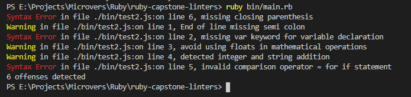

# ruby-capstone-linters

## Description
This is a project which entails building a custom linter. The linter built in this project is to help beginners in javaScript check for syntax errors like forgetting the use of Var keyword when declaring variables, performing mathematical operations using floats, missing semi colon at the end of a statement, adding strings to itegers, using = sign in if conditional and forgeting to close open parenthesis.

## Built With

- Ruby 2.5.5p157/2.6.6p146
- VS Code
- RSpec
- Rubocop

### Prerequisites

- Ruby
- rspec

## Getting Started

To get a local copy up and running follow these simple example steps.

### Setup

- To Clone the project to your local machine Click on [this link](https://github.com/tGodson)
- Click on the green clone button to your right and copy the link to the repo
- Move to the terminal of you code editor and cd to where you want to setup your project
- Type "git clone paste_the_copied_link_here"
- The project is now on your local machine

## How to run the project
- Open the terminal on your code editor
- cd into your project folder
- Type "bin/main" and press the enter button on your keyboard 

## How to run the rspec test

- open the terminal on your code editor
- cd into your project folder
- type "rspec" and press the enter button on your keyboard

## Good and Bad code

## Bad code
- `var x = 1 + 2` missing semi colon at end of statement
- `x = 1 + 2;` missing var key word for variable declaration
- `var x = "1" + 2;` detected adding an integer to a string
- `var x = 1.0 + 2;` avoid using floats in mathematical operations
- `if(x=y);` invalid comparison operator for if condition

## Good code
- `var x = 1 + 2;` 
- `if(x==y);`

## Screenshot 

## Author

👤 **Tendongze Godson**

- Github: [@tGodson](https://github.com/tGodson) 
- Twitter: [@tendongze-godson](https://twitter.com/tendongze-godson) 
- Linkedin: [linkedin](https://linkedin.com/in/tendongze95) 

## 🤝 Contributing

Contributions, issues and feature requests are welcome!

Feel free to check the <a href="https://github.com/tGodson/ruby-capstone-linters/issues" target="_blank">issues page</a>.

## Show your support

Give a ⭐️ if you like this project!

## Acknowledgments
 
- <a href="https://www.theodinproject.com/" target="_blank">The Odin Project</a>
- <a href="https://ruby-doc.org/core-2.6.1/" target="_blank">Ruby Docs</a>
- <a href="https://www.stackoverflow.com/" target="_blank">Stackoverflow</a>

